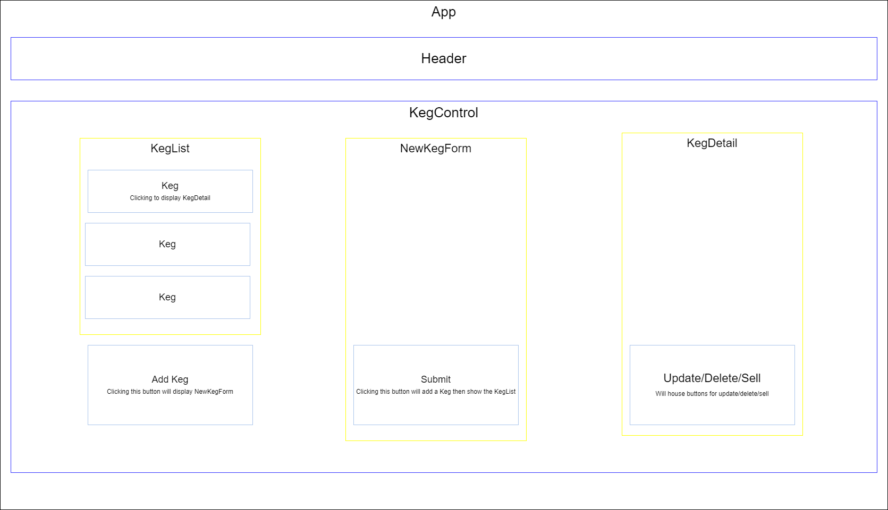

<br>
<p align="center">
  <u><big>|| <b> Tap-Room-Redux !</b> || </big></u>
</p>
<p align="center">
  <p align="center">
  </p>
  <p align="center">
    <a href="https://github.com/MorganJBradford">
      <strong>Morgan Bradford</strong>
    </a>
  </p>

<p align="center">
  <small>Initiated April 23th.</small>
</p>
<p align="center">
    <a href="https://github.com/MorganJBradford/tap-room-redux"><big>Project Docs</big></a> ·
    <a href="https://github.com/MorganJBradford/tap-room-redux/issues"><big>Report Bug</big></a> ·
    <a href="https://github.com/MorganJBradford/tap-room-redux/issues"><big>Request Feature</big></a>
</p>

## 🌐 About the Project

### 📖 Description
A website for establishments selling alcohol to manage their kegs, and their kegs' contents. 

### 🦠 Known Bugs

* No known bugs

### 🛠 Built With

* [Visual Studio Code](https://code.visualstudio.com/)
* [JavaScript](https://developer.mozilla.org/en-US/docs/Web/JavaScript)
* [Jest](https://jestjs.io)
* [React](https://reactjs.org)
* [Redux](https://redux.js.org)
* [React Redux](https://react-redux.js.org)
* [Git & GitHub](https://github.com/)

------------------------------
## Component Tree
<p align="center">
  
</p>

------------------------------

## 🏁 Getting Started

### 📋 Prerequisites

  #### Code Editor

  To view or edit the code, you will need a code editor or text editor. The popular open-source choices for code editors are Atom and Visual Studio Code.

  1) Code editor download:
      * Option 1: [Atom](https://atom.io/)
      * Option 2: [Visual Studio Code](https://code.visualstudio.com/)
  2) Click the download most applicable to your OS and system.
  3) Wait for download to complete, then install -- Windows will run the setup exe and macOS will drag and drop into applications.
  4) Open your editor, and open the Command Palette by pressing `Cmd+Shift+P` for Mac, or `Ctrl-shift-p` for Windows
      * For VS Code, type `Shell Command: Install 'code' command in PATH` into the Command Palette.
      * For Atom, type `Install Shell Commands` into the Command Palette.
  5) Optionally, create a [GitHub account](https://github.com)

### ⚙️ Setup and Use

  #### Cloning

  1) Navigate to the [repository here](https://github.com/MorganJBradford/tap-room-redux).
  2) Click 'Code' to reveal the HTTPS url ending with .git and the 'Download ZIP' option.
  3) Open up your system Terminal or GitBash, navigate to your desktop with the command: `cd Desktop`, or whichever location suits you best.
  4) Clone the repository to your desktop: `$ git clone https://github.com/MorganJBradford/tap-room-redux.git`
  5) Run the command `cd tap-room-redux` to enter into the project directory.
  6) View or edit:
      * Code editor - Run the command `atom .` or `code .` to open the project in Atom or Visual Studio Code respectively for review and editing.
      * Text editor - Open by double clicking on any of the files to open in a text editor.

  #### Download

  1) Navigate to the [repository here](https://github.com/MorganJBradford/tap-room-redux).
  2) Click 'Code' to reveal the HTTPS url ending with .git and the 'Download ZIP' option.
  3) Click 'Download ZIP' and extract.
  4) Open by double clicking on any of the files to open in a text editor.
  
  #### Launch Application

  * In the  top level directory, tap-room-redux:
      1. Enter `npm install` in your terminal.
      2. Enter `npm start` in your terminal.

------------------------------

## 🤝 Contact

| Linkedin | GitHub | Email |
|--------|:------:|:-----:|
| [Morgan Bradford](https://www.linkedin.com/in/morganjbradford/) | [MorganJBradford](https://github.com/MorganJBradford) | [morganjbradford95@gmail.com](mailto:morganjbradford+github95@gmail.com?subject=[GitHub]Epicodus%20Team%20Week%20-%20Dad%20Joke%20Discord%20Bot) |

------------------------------

## ✉️ Contact and Support

If you have any feedback or concerns, please contact me (see info above).

<p>
  <a href="https://github.com/MorganJBradford/tap-room-redux/issues">Report Bug</a> ·
  <a href="https://github.com/MorganJBradford/tap-room-redux/issues">Request Feature</a>
</p>

------------------------------

## ⚖️ License

This project is licensed under the [MIT License](https://opensource.org/licenses/MIT). Copyright (C) 2021 Morgan Bradford. All Rights Reserved.

```
MIT License

Copyright (c) 2021 Morgan Bradford

Permission is hereby granted, free of charge, to any person obtaining a copy
of this software and associated documentation files (the "Software"), to deal
in the Software without restriction, including without limitation the rights
to use, copy, modify, merge, publish, distribute, sublicense, and/or sell
copies of the Software, and to permit persons to whom the Software is
furnished to do so, subject to the following conditions:

The above copyright notice and this permission notice shall be included in all
copies or substantial portions of the Software.

THE SOFTWARE IS PROVIDED "AS IS", WITHOUT WARRANTY OF ANY KIND, EXPRESS OR
IMPLIED, INCLUDING BUT NOT LIMITED TO THE WARRANTIES OF MERCHANTABILITY,
FITNESS FOR A PARTICULAR PURPOSE AND NONINFRINGEMENT. IN NO EVENT SHALL THE
AUTHORS OR COPYRIGHT HOLDERS BE LIABLE FOR ANY CLAIM, DAMAGES OR OTHER
LIABILITY, WHETHER IN AN ACTION OF CONTRACT, TORT OR OTHERWISE, ARISING FROM,
OUT OF OR IN CONNECTION WITH THE SOFTWARE OR THE USE OR OTHER DEALINGS IN THE
SOFTWARE.
```

------------------------------

## 🌟 Acknowledgements

#### [Epicodus](https://www.epicodus.com/)
>"A school for tech careers... to help people learn the skills they need to get great jobs."

#### [The Internet](https://webfoundation.org/)
>"...the first thing that humanity has built that humanity doesn't understand..."

-Eric Schmidt, Google (Alphabet Inc.)

------------------------------

<p align="center"><a href="#">Return to Top</a></p>